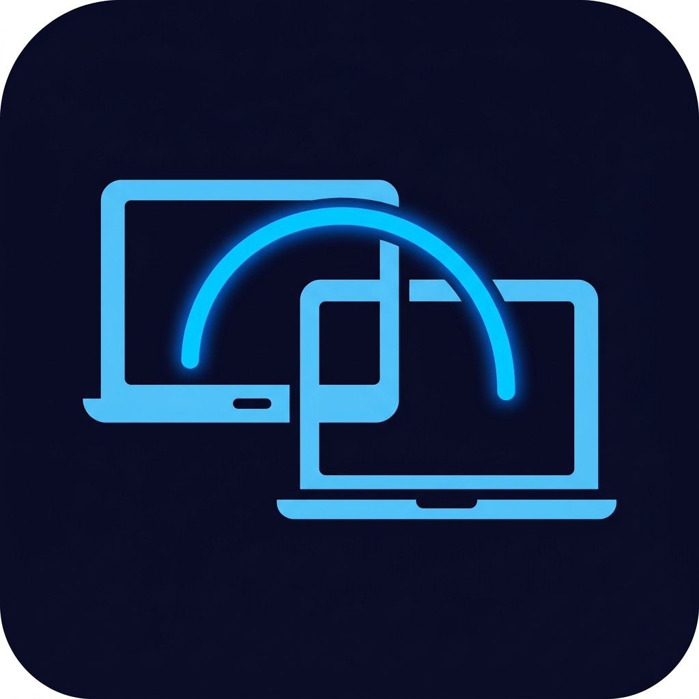

# ScreenLink

> Share any window with nearby laptops — real-time collaborative screen sharing over local WiFi.

<p align="center">
  
</p>

## What is ScreenLink?

ScreenLink lets you **share any window** from your laptop to another laptop on the same WiFi — instantly. No accounts, no servers, no internet required. Just open the app on both laptops and start collaborating.

### ✨ Features

- 📡 **Auto-Discovery** — Laptops find each other automatically (zero configuration)
- 📺 **Window Sharing** — Share any specific window, not your entire screen
- 🖱️ **Remote Input** — The other person can click and type on the shared window
- 👻 **Send Away** — Hide the window from your screen to free space (other laptop still sees it)
- 🔒 **Private** — Works only on local WiFi, no data leaves your network
- 🔔 **Accept/Reject** — You choose whether to accept incoming shares

## Install (Linux)

### Option 1: Quick Install (Recommended)

```bash
# 1. Download the AppImage and install.sh from the Releases page
# 2. Run:
chmod +x install.sh
./install.sh
```

Then search **"ScreenLink"** in your app launcher — done!

### Option 2: Manual

```bash
# Download the AppImage from Releases, then:
chmod +x ScreenLink-*.AppImage
./ScreenLink-*.AppImage
```

### Dependencies

For full functionality (remote input + window management), install:
```bash
sudo apt install xdotool wmctrl
```

## How to Use

1. **Install ScreenLink** on both laptops
2. **Connect to the same WiFi**
3. **Open ScreenLink** on both — they find each other automatically
4. **Right-click the tray icon** → pick a window → pick a device
5. The other laptop gets a popup → **Accept** → sees the window live

## Screenshots

*Coming soon*

## Download

👉 Go to the [**Releases**](../../releases) page to download the latest version.

## License

All rights reserved. This software is provided as-is for personal use.
