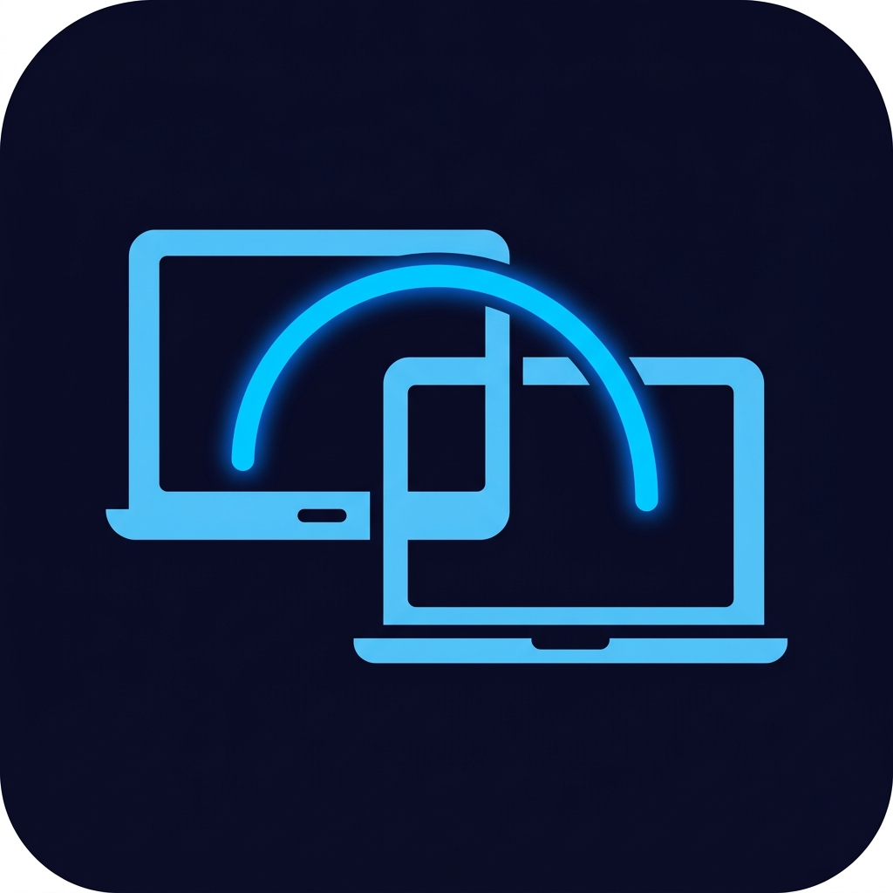

<p align="center">
  
</p>

<h1 align="center">Parallel</h1>

<p align="center">
  Private screen collaboration for computers on the same local network.
</p>

<p align="center">
  <a href="../../releases/latest"><strong>Download the latest release</strong></a>
</p>

## About Parallel

Parallel connects nearby computers without accounts, cloud storage, or a central server. Create a room, let other computers on the same network join, and begin sharing your screen.

The public repository is the official home for Parallel downloads and user documentation. The application source is maintained in a separate private repository.

## Features

- Automatic discovery on the same Wi-Fi or Ethernet network
- Optional room passwords
- Standard and administrator-managed collaboration rooms
- One-to-many screen sharing
- Up to 4K/60 FPS when the network and computers support it
- Host-approved remote control for supported Linux sharing computers
- Clipboard sharing
- File transfer up to 2 MB
- No account or internet connection required

## Platform support

| Capability | Linux | Windows |
| --- | --- | --- |
| Create and join rooms | Yes | Yes |
| Share and view a screen | Yes | Yes |
| Collaboration rooms | Yes | Yes |
| Clipboard and file transfer | Yes | Yes |
| Control a Linux sharing computer | Yes | Yes |
| Control a Windows sharing computer | Not yet | Not yet |

Remote control depends on the operating system of the computer sharing its screen. Parallel automatically hides the control request when the sharing computer does not support it.

## Install on Windows

1. Download `Parallel-Setup-0.2.0-x64.exe` from the [latest release](../../releases/latest).
2. Run the installer and follow the setup steps.
3. When Windows Firewall asks for permission, allow Parallel on **Private networks** only.
4. Open Parallel from the Start menu or desktop shortcut.

The current installer is not code-signed. Windows may therefore display an “Unknown publisher” or SmartScreen warning. Only continue after confirming that the installer came from this repository and that its SHA-256 value matches `SHA256SUMS.txt` in the release.

## Run on Linux

1. Download `Parallel-0.2.0-x86_64.AppImage` from the [latest release](../../releases/latest).
2. Make it executable and run it:

```bash
chmod +x Parallel-0.2.0-x86_64.AppImage
./Parallel-0.2.0-x86_64.AppImage
```

For launcher integration, download `install-linux.sh` beside the AppImage and run:

```bash
chmod +x install-linux.sh
./install-linux.sh
```

On Ubuntu, X11 remote control may require `xdotool`, while AppImage support on some releases may require `libfuse2`:

```bash
sudo apt install xdotool libfuse2
```

Wayland remote control uses the desktop’s XDG portal and displays a system permission dialog.

## Using Parallel

1. Connect both computers to the same trusted Wi-Fi or Ethernet network.
2. Open Parallel on every computer.
3. Give each computer a recognizable device name.
4. On one computer, create a Share Room or Collaboration Room.
5. On the other computer, select the discovered room or enter its six-character code.
6. Start sharing from the room dashboard.

## Network and privacy

Parallel does not use an external signaling or media server. Discovery, coordination and screen traffic remain on the local network. WebRTC encrypts the screen stream and remote-input channel.

Use Parallel only on a trusted private network. Clipboard and file-transfer messages use the local signaling connection and should not be used on an untrusted or public Wi-Fi network.

## Verify a download

Linux:

```bash
sha256sum -c SHA256SUMS.txt
```

Windows PowerShell:

```powershell
Get-FileHash .\Parallel-Setup-0.2.0-x64.exe -Algorithm SHA256
```

Compare the result with the Windows entry in `SHA256SUMS.txt`.

## License

Parallel is proprietary software provided for personal, non-commercial use. See [LICENSE](LICENSE) for the complete terms.
